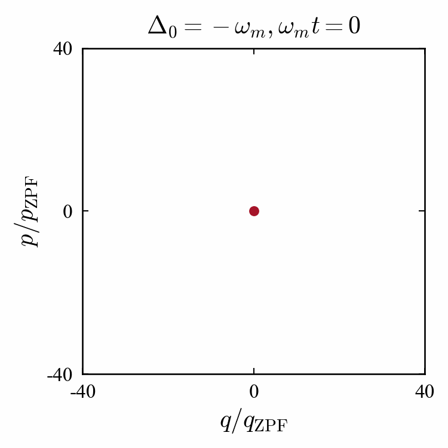

# The Quantum Optomechanics Toolbox

[](https://sampreet.github.io/qom-docs)
[](https://github.com/sampreet/qom/blob/master/CHANGELOG.md)

[](https://github.com/sampreet/qom/releases/tag/v1.1.0)
[](https://github.com/sampreet/qom/issues?q=is%3Aopen+is%3Aissue)
[](https://github.com/sampreet/qom/issues?q=is%3Aissue+is%3Aclosed)

> A library of modules for computational quantum optomechanics... and beyond!

The Quantum Optomechanics Toolbox (packaged as `qom`) is a wrapper-styled, scalable toolbox featuring multiple modules for the calculation of stationary as well as dynamical properties of many-body quantum optomechanical systems.
Backed by numerical libraries like NumPy and SciPy, and featuring the highly customizable visualizations offered by Matplotlib and Seaborn APIs, the toolbox aims to serve as an easy-to-use alternative to writing code explicitly and avoiding repetitive exercises for presentable visuals.

> **Note**  
> The toolbox is not under active maintenance since 2023 and addition of newer features are not planned for the near future.
> However, the current CPU-based modules fully support the simulation of linearized quantum optomechanical systems and their related analysis.
> For the simulation of more general systems, ``QuTiP`` (``> v5.0``) provides a much faster interface.

### Key Features!

* Run automatically-managed loops in parallel and pool results.
* Solve for stability and classical/quantum signatures seamlessly.
* Configure plots across plotting libraries with a common syntax.

### What's New in v1.x!

* Non-linear Schrodinger equation solver with integration support.
* Attractor detection and bifurcation for non-linear dynamical systems.
* Huge performance boost with NumPy-based vectorization.

| Dynamical Stability | Quantum Correlations | 
|---|---|
|  |  |
| Runtimes for the calculation of dynamical stability of the steady state using the Routh-Hurwitz criteria. | Runtimes for the calculation of average entanglement from the dynamical values of modes and correlations. |

## Examples

| Classical Amplitudes | Quantum Fluctuations | 
|---|---|
|  |  |
| The classical mean values of the optical and mechanical modes are obtained using the rate equations of the modes. | The variances of the quantum fluctuation quadratures are obtained using the rate equation for the correlation matrix. |

| Fixed Point | Limit Cycle | 
|---|---|
|  |  |
| An optomechanical system settling to a steady state. | Self-sustained oscillations in an optomechanical system. |

| Dynamical Stability | Optical Bistability |
|---|---|
|  |  |
| Dynamical stability obtained from the steady state drift matrix. | Bistability obtained from the steady state optical occupancies. |

| Optomechanical Entanglement | Mechanical Synchronization |
|---|---|
|  |  |
| Quantum entanglement between the optical and mechanical modes of an optomechanical system. | Quantum phase synchronization between the mechanical modes of two coupled identical systems. |

| Wigner Distributions | Optomechanical Solitons |
|---|---|
|  |  |
| Wigner distribution depicting the evolution of mechanical squeezing in a modulated optomechanical system. | Soliton propagation in an array of optomechanical systems at different phase lags between the input solitons. |

A set of notebooks and scripts to demonstrate the usage of the toolbox can be found in the [examples repository](https://github.com/sampreet/qom-examples).
Research papers solved using the toolbox can be found in the [papers repository](https://github.com/sampreet/qom-papers).

## Installation

### Dependencies

[The Quantum Optomechanics Toolbox](https://github.com/sampreet/qom) requires `Python 3.8+`, preferably installed via the [Anaconda distribution](https://www.anaconda.com/download).
Once `Anaconda` is set up, create and activate a new `conda` environment using:

```bash
conda create -n qom python
conda activate qom
```

The toolbox primarily relies on `numpy` (for fast numerical algebra), `scipy` (for numerical methods), `sympy` (for symbolic algebra), `matplotlib` (for plotting results) and `seaborn` (for color palettes).
These libraries can be installed using:

```bash
conda install numpy scipy sympy matplotlib seaborn "pyqt<6.0.0"
```

***Note: PyQt5 is only required to run the GUI modules and can skipped.***

Once the dependencies are installed, the toolbox can be installed via GitHub or locally.

The documentation of the latest release is available [here](https://sampreet.github.io/qom-docs).

### Installing via GitHub

To install the last release via the Python Package Index, execute: 

```bash
pip install git+https://github.com/sampreet/qom.git
```

### Installing Locally

To install the latest version locally, download the repository as `.zip` and extract the contents.
Now, execute the following from *outside* the top-level directory, `ROOT_DIR`, inside which `setup.py` is located (refer to the [file structure](./CONTRIBUTING.md)):

```bash
pip install -e ROOT_DIR
```

## Basic Usage

The library features easy-to-use functions to calculate as well as visualize the trend of several quantum signatures.
A complete API documentation is available in the [official website](https://sampreet.github.io/qom-docs).

### Loopers

The classes `XLooper`, `XYLooper` and `XYZLooper` loop over specific functions and parameters that are passed as arguments during initialization.
The `loop` method returns the results in the form of a dictionary of the axes (`X`, `Y` and `Z`) and the calculated values `V`.
The threshold values of the axes at which the calculations reach their minima or maxima can also be obtained using the `get_thresholds` method.

For example, the `qom.looper.axes.XLooper` class can be implemented as:

```python
# initilize the looper with the function to loop and the looper parameters
looper = XLooper(func, params)
# get resultant dictionary containing keys `X` and `V`.
results = looper.loop()
# obtain the threshold values of the inputs
thres = looper.get_thresholds()
```

Here, `func` is a function containing the steps of each iteration and `params` is a dictionary containing the parameters of the looper.
The complete documentation of the loopers is available [here](https://sampreet.github.io/qom-docs/qom.loopers.html).

### Solvers

Solvers constitute of a set of classes to tackle numerical computations of various forms. 
Each solver is associated with a particular method, measure or criterion. 

For example, the `qom.solvers.deterministic.HLESolver` generates the time-varying solutions of the classical mode amplitudes and quantum correlations by solving the Heisenberg-Langevin equations and can be implemented as:

```python
# initialize the solver with an instance of the system and solver parameters
solver = HLESolver(system, solver_params)
# solve for the dynamics of modes and correlations
Modes, Corrs = solver.get_modes_corrs()
```

Here, `system` is an instance of the user-defined system and `solver_params` is a dictionary containing the parameters of the solver.
The complete documentation of the solvers is available [here](https://sampreet.github.io/qom-docs/qom.solvers.html).

### Systems

The `BaseSystem` class registers basic functionalities to streamline the solving and looping processes.

For example, the built-in function `get_mean_optical_occupancies` returns the intracavity photon numbers and can be implemented as:

```python
# initialize the system with system parameters
system = MySystem(
    params=system_params
)
# obtain mean occupancy of the optical mode
N_os = system.get_mean_optical_occupancies()
```

Here, `MySystem` is a class inheriting `BaseSystem`, initialized by `system_params`, which is a dictionary containing the parameters of the system.
The complete documentation of the `BaseSystem` class is available [here](https://sampreet.github.io/qom-docs/qom.systems.base.html).

### UI

User-interface modules like `qom.ui.log` and `qom.ui.gui` provide console as well as graphical features to keep track of parameters and progress.
Plotters wrap independent visualization packages of Python under an equivalent syntax. 
An implementation of `qom.ui.plotters.MPLPlotter` wrapping the `matplotlib` package is given below:

```python
# initialize the plotter
plotter = MPLPlotter(
    axes={},
    params=plotter_params
)
# update the plot
plotter.update(
    vs=vs,
    xs=xs
)
# display the plot
plotter.show()
```

### Utils

Utility functions provide an extra layer of ease over the other modules.
The `qom.utils.loopers` module contains various functions that wrap loopers, together with an option to use plotter modules to visualize the results, thus trimming down several lines of code.
Similarly, the `qom.utils.solvers` module contains various functions to quickly obtain dynamical or steady state properties and signatures.

For example, the `qom.utils.loopers.wrap_looper` function and the `qom.utils.solvers.get_func_quantum_correlation_measures` function can be utilized to cover everything in a single line of code:

```python
# wrap looper and plot
wrap_looper(
    looper_name='XLooper',
    func=get_func_quantum_correlation_measures(
        SystemClass=MySystem,
        params=solver_params
    ),
    params=looper_params,
    params_system=system_params,
    plot=True,
    params_plotter=plotter_params
)
```

Alternatively, parallel instances of the loopers can be run using the `qom.utils.loopers.run_loopers_in_parallel` function.

## Contributing

If you want to contribute to The Quantum Optomechanics Toolbox, check out the [contribution guidelines](./CONTRIBUTING.md).
Also, make sure you adhere to the [code of conduct](./CODE_OF_CONDUCT.md).

## Citing

Please cite [S. Kalita and A. K. Sarma, *The QOM Toolbox: An Object-oriented Python Framework for Cavity Optomechanical Systems*, Proceedings of Eighth International Congress on Information and Communication Technology, Lecture Notes in Networks and Systems, Volume 694, 581-590, Springer Nature Singapore (2023)](./CITATION.bib) if you use our work in your research.